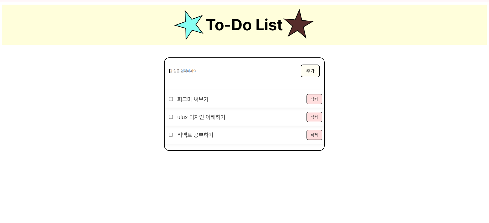

# ⭐ Cute To-Do List

심플 귀여운 투두리스트 간단 프로젝트

 

## 🔗 배포 링크
👉 [https://rinakang.github.io/cutetodo-list/](https://rinakang.github.io/cutetodo-list/)

 

## ✨ 기능
- ✅ 할 일 추가 (버튼 클릭 또는 엔터키)
- ✅ 체크박스로 완료 표시 (취소선 효과)
- ✅ 삭제 버튼으로 항목 삭제

 

## 🛠 사용 기술

바닐라JS로 구현하였습니다.
